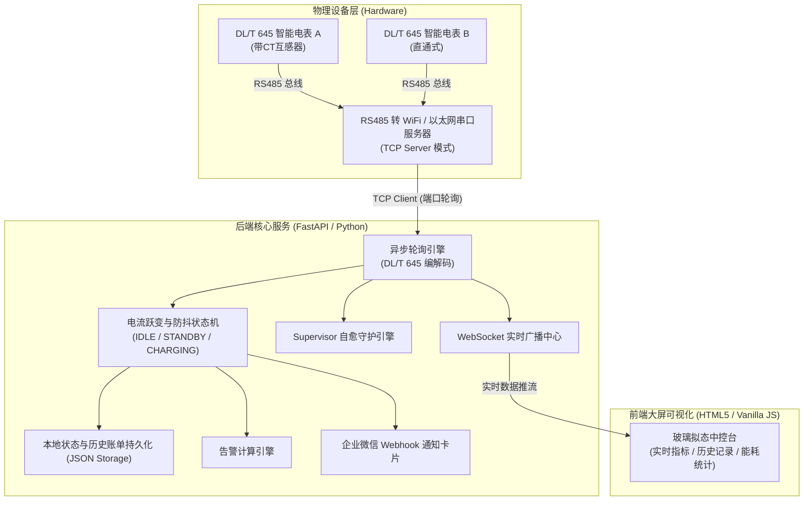

# ⚡ Smart Meter Monitor (智能电表与充电桩物联网监控系统)

[](https://opensource.org/licenses/MIT)
[](https://www.python.org/)
[](https://fastapi.tiangolo.com)
[]()

> 基于 **DL/T 645-2007 规约**、**FastAPI** 与 **原生 WebSocket** 的工业级 380V/220V 智能电表与新能源充电桩远程监控中心。  
> 支持电流跃变物理防抖侦测、尖峰平谷分时计量、企业微信卡片推送、自适应动态心跳、串口服务器拓扑监控与服务进程自愈（Supervisor）。

---

## 🌟 核心特性 (Features)

1. **⚡ 电流跃变物理防抖状态机 (Physical Debounce State Machine)**
   - 自动识别 `IDLE (空闲)` ➔ `STANDBY (待机/继电器吸合)` ➔ `CHARGING (大电流充电中)` 状态切换。
   - 毫秒级电流突变响应：插枪或开闸时瞬间感知，0 延时触发推送。
   - 3 周期滤波防抖：有效消除电网冲击毛刺与瞬时断流误判。

2. **📡 自适应动态心跳调频 (Adaptive Heartbeat Engine)**
   - **空闲休眠模式**：无人使用时每 3 分钟轮询一次，保护 RS485 总线健康与防第三方接口限频。
   - **作业提速模式**：一旦检测到扫码充值或继电器闭合，自动提速至高频实时追踪。

3. **📊 DL/T 645-2007 协议全面解析**
   - **电能数据**：正向有功总电量、反向有功总量、尖/峰/平/谷分时复费率电量。
   - **电网电气量**：A/B/C 三相独立电压、三相电流、总有功功率、功率因数。
   - **时钟校准对比**：直接透传电表硬件时钟寄存器（`0400010C`），与客户端系统时间毫秒级动态对照。
   - **互感器支持**：支持配置 CT 互感器变比（如 20:1 等），自动计算真实一次侧电气参数。

4. **🚨 工业级告警中心 & 企业微信 Webhook 卡片推送**
   - 物理阈值监测：过压、欠压、过流、功率异常告警，设备离线与通讯恢复提示。
   - Markdown 交互通知：充电开始、充电结束（附带耗电度数、剩余余额与尖峰平谷明细），支持动态配置局域网与公网直连访问卡片。

5. **🛡️ 异步高并发与自愈架构 (Supervisor Watchdog)**
   - 底层全链路超时熔断（Timeout Guard），避免客户端断网造成 TCP 发送阻塞。
   - 后台守护巡检引擎：每 5 秒扫描协程状态，任务发生异常时 5 秒内自动重启拉起，保障 7x24h 零假死。

6. **💻 玻璃拟态现代化大屏 (Glassmorphism Dashboard)**
   - 纯原生 HTML5/ES6/CSS3 开发，零重型框架依赖，秒级极速加载。
   - 全站实时大盘总览、历史充电账单明细、日度/月度运营能耗控制台、串口服务器网络状态拓扑。

---

## 🏗️ 系统架构图 (Architecture)



---

## 📁 目录结构 (Directory Structure)

```text
meter_monitor/
├── backend/
│   ├── main.py                  # FastAPI 主服务、DL/T 645 规约编解码与业务状态机
│   ├── chargers.example.json    # 充电桩与电表拓扑配置模板
│   ├── requirements.txt         # Python 依赖清单
│   └── test_*.py                # 串口与协议连通性调试脚本
├── frontend/
│   ├── index.html               # 监控大屏主视图
│   ├── app.js                   # WebSocket 客户端驱动与多看板交互逻辑
│   └── style.css                # 玻璃拟态极光主题样式表
├── .env.example                 # 环境变量模板
├── .gitignore                   # 敏感数据与运行环境忽略规则
├── Dockerfile                   # 容器镜像构建文件
├── docker-compose.yml           # Docker 一键编排文件
├── LICENSE                      # 开源授权证书 (MIT)
└── README.md                    # 项目说明文档
```

---

## 🚀 快速开始 (Quick Start)

### 方式一：本地 Python 运行

1. **克隆仓库**
   ```bash
   git clone https://github.com/your-username/smart-meter-monitor.git
   cd smart-meter-monitor
   ```

2. **准备配置文件**
   复制示例配置并修改为您的实际电表参数：
   ```bash
   cp backend/chargers.example.json backend/chargers.json
   ```

3. **安装依赖并启动**
   ```bash
   # 安装依赖
   pip install -r backend/requirements.txt

   # 启动后端服务 (端口 3004)
   cd backend
   uvicorn main:app --host 0.0.0.0 --port 3004
   ```

4. **访问大屏**
   打开浏览器访问：`http://localhost:3004/ui/index.html`（默认后台密码：`123456`）。

---

### 方式二：Docker 容器一键部署

```bash
# 构建并后台启动容器
docker-compose up -d

# 查看运行日志
docker-compose logs -f
```

---

## ⚙️ 配置说明 (Configuration)

在 `backend/chargers.json` 中配置您的设备拓扑：

```json
{
  "charger-1": {
    "host": "192.168.1.100",           // 串口服务器 IP 地址
    "port": 8887,                      // 串口服务器监听端口
    "address": "000000000001",         // DL/T 645 电表通讯地址 (12位BCD码)
    "name": "1号充电桩",               // 设备展示名称
    "ct_ratio": 1,                     // 互感器倍率 (直通式填 1，带互感器填实际变比如 20)
    "protocol": "DL/T645-2007"         // 电表规约协议
  }
}
```

### 环境变量 (可选)

| 变量名 | 默认值 | 说明 |
| :--- | :--- | :--- |
| `PORT` | `3004` | Web 服务监听端口 |
| `DASHBOARD_LAN_URL` | `http://localhost:3004/ui/index.html` | 企业微信推送卡片中的局域网访问链接 |
| `DASHBOARD_WAN_URL` | `""` | 企业微信推送卡片中的公网访问链接 |

---

## 🔌 硬件接线与串口调试说明 (Hardware & Wiring)

1. **串口服务器设置**：
   - 协议模式选择 **TCP Server** 或 **None**（透传模式）。
   - 波特率：通常为 **2400** 或 **9600** bps。
   - 数据位/校验位/停止位：标准规约通常为 **8, E, 1**（偶校验）或 **8, N, 1**。
2. **CT 互感器穿线规范**：
   - 电流互感器（圆环）**只能穿过单根相线（火线）**。严禁将火线与零线一同穿过互感器，否则磁场抵消将导致电流测量值为 0。
   - 确保 S1、S2 信号线接线牢固，并在系统配置中填入对应的 `ct_ratio`（例如 100/5A 互感器填入 `20`）。

---

## 📄 开源许可证 (License)

本项目遵循 [MIT License](LICENSE) 协议开源。
